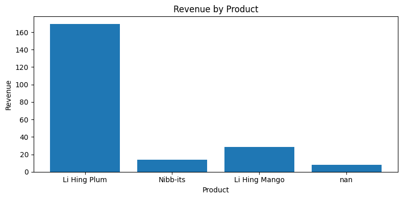
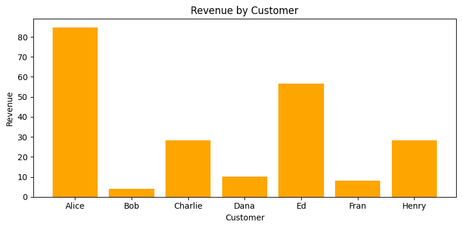

# CSV Order Analyzer — Portfolio Write-up

Project summary
- Name: CSV Order Analyzer
- Short description: A small CLI and interactive app to clean, validate, and summarize CSV order data. Demonstrates data engineering, validation, testing, packaging, and an interactive visualization.

Why this project is compelling
- Real-world: CSVs are ubiquitous and often messy — this project shows how to turn messy inputs into reliable outputs.
- Full-stack Python: file I/O, data validation, reporting, testing (unit tests), CI, packaging, and a demo UI (Streamlit).
- Reproducible: tests and CI ensure correctness; packaging makes it installable.

Technical highlights
- Robust CSV validation: detects missing fields, invalid numeric types, non-positive values, and duplicates.
- Modular design: `src/processing.py`, `src/summary.py`, `src/io.py`, and `src/main.py` for clear separation of concerns.
- Test coverage: unit tests for processing and summarization; CI workflow to run tests on push/PR.
- Interactive demo: Streamlit app that accepts uploads and displays cleaned data and charts.
- Packaging: PEP 621 `pyproject.toml` with a console script entry point `csv-order-analyzer`.

How to run
1. Quick run (default paths):

```bash
python src/main.py
```

2. Run the Streamlit demo:

```bash
streamlit run streamlit_app.py
```

3. Run tests (lightweight runner included):

```bash
python run_tests.py
```

Key files to review
- `src/main.py` — CLI entry point
- `src/processing.py` — validation and classification logic
- `src/summary.py` — summarization and report formatting
- `src/io.py` — CSV writing helpers
- `tests/test_main.py` and `run_tests.py` — tests
- `notebooks/demo.ipynb` — walkthrough and visualizations
- `streamlit_app.py` — interactive demo

Challenges and solutions
- Challenge: balancing permissive parsing with strict validation. Solution: explicit classification into valid/invalid/duplicate with clear error messages and unit tests.
- Challenge: making the project feel portfolio-ready. Solution: added docs, packaging, CI, notebook, demo app, and polished write-up.

Possible extensions (future work)
- Add more extensive test coverage and property-based tests (Hypothesis).
- Export more analytics (time-series revenue, forecasts) or connect to a small database.
- Add benchmarks and performance tests for larger CSVs.
- Provide a web deployment of the Streamlit app.

Notes for interview talking points
- Explain the validation pipeline and show sample failing rows.
- Discuss design trade-offs for duplicates handling (first-seen vs. keep-all with conflict resolution).
- Walk through the CI workflow and how tests prevent regressions.

Contact & license
- License: MIT (add LICENSE if needed)
- Repo: local workspace; include GitHub link when publishing

## Screenshots

- **Revenue by Product:**

	

- **Revenue by Customer:**

	

Screenshots were auto-generated from `notebooks/demo.ipynb` and saved to `reports/screenshots/`.

To regenerate the executed notebook and screenshots locally, run:

```bash
jupyter nbconvert --to notebook --execute notebooks/demo.ipynb --output notebooks/executed_demo.ipynb --ExecutePreprocessor.timeout=600
python -c "from pathlib import Path; import nbformat, base64; nb=nbformat.read('notebooks/executed_demo.ipynb',4); Path('reports/screenshots').mkdir(parents=True,exist_ok=True); ..."
```

For interactive screenshots, run the Streamlit demo and capture the browser window:

```bash
streamlit run streamlit_app.py
```

Include or replace these images in your portfolio documents where appropriate.
